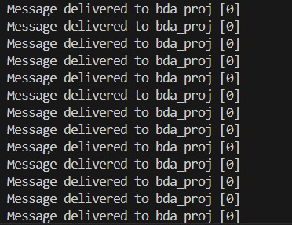
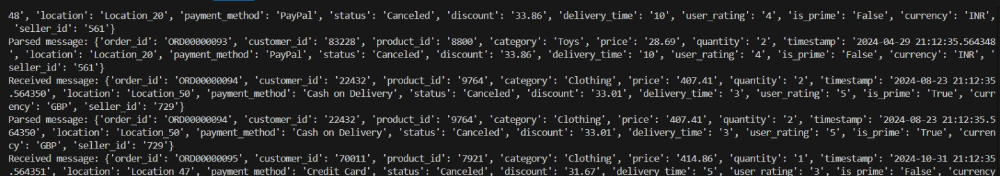
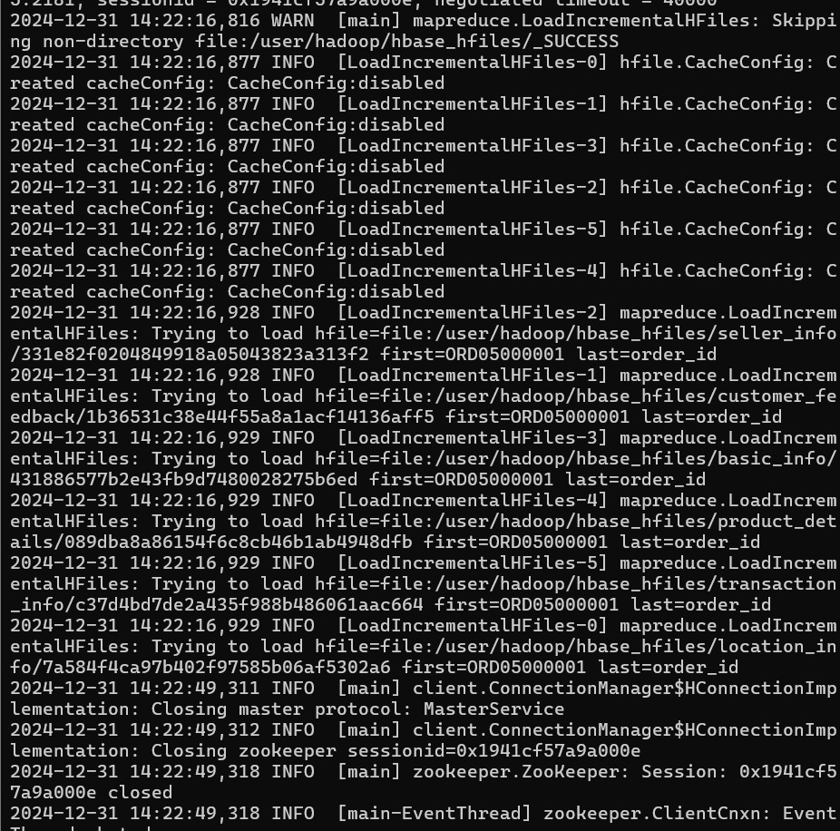
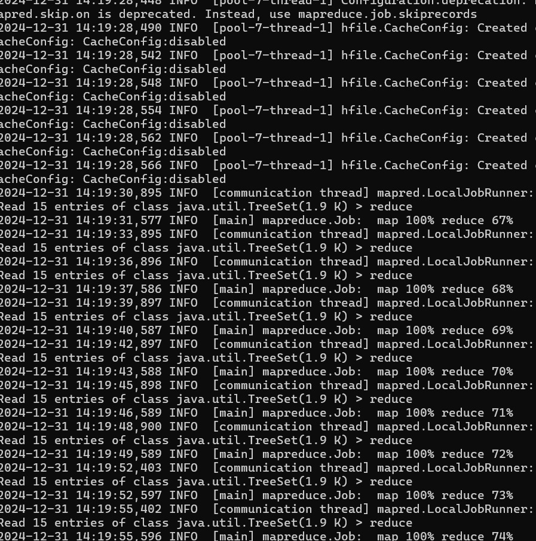
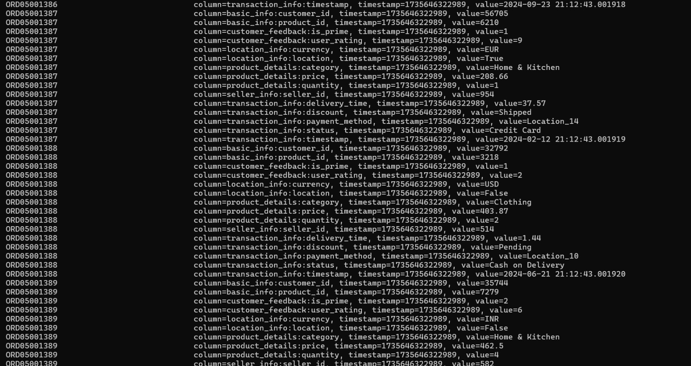
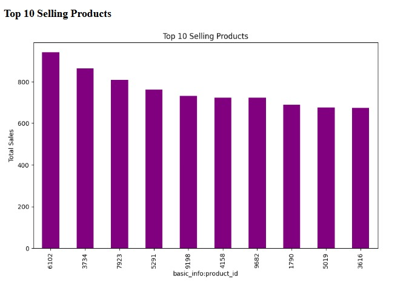
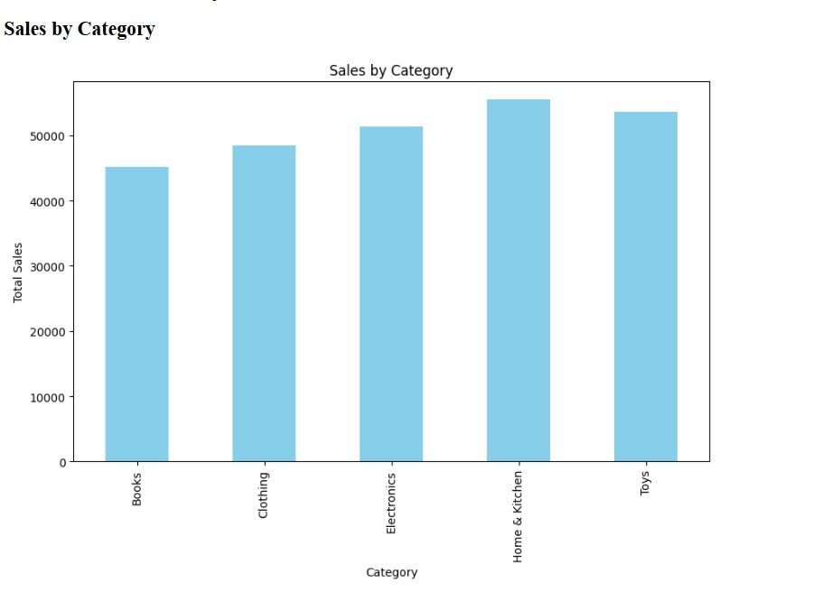
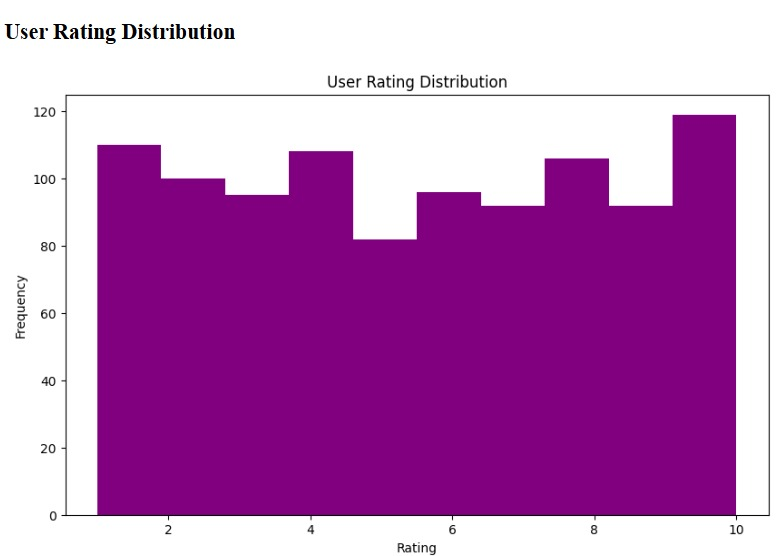
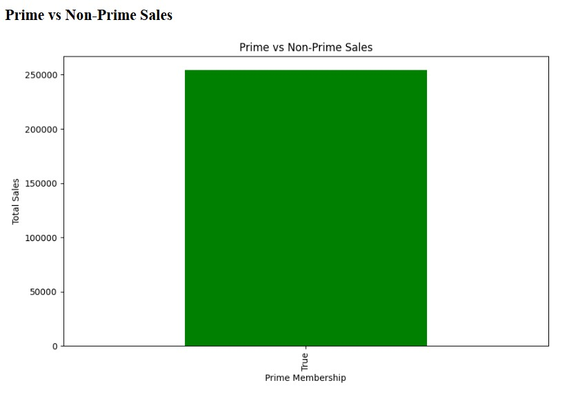
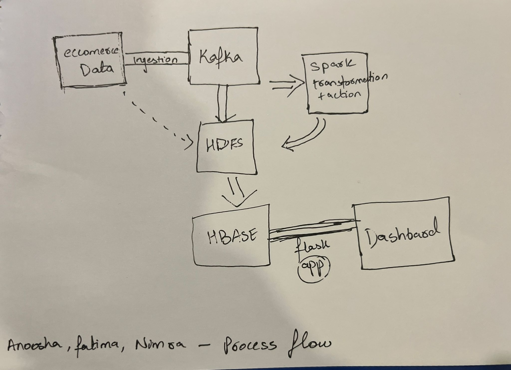

# Ecommerce-analytics
# Real-Time E-Commerce Analytics with Big Data Tools

## Overview
This project demonstrates a comprehensive pipeline for real-time analytics on e-commerce data, leveraging cutting-edge Big Data technologies. It simulates an online retail environment, processes streaming data, and provides actionable insights via interactive dashboards. The project integrates data generation, ingestion, transformation, and visualization, showcasing the end-to-end capabilities of modern analytics systems.

---

## Problem Statement
E-commerce platforms generate massive amounts of data every second. Extracting timely insights from this data is challenging due to:

- **Data Volume**: Managing and processing terabytes of data efficiently.
- **Real-Time Needs**: Providing insights in near real-time for decision-making.
- **Scalability**: Building a system that can scale with increasing data volumes.
- **User Insights**: Understanding customer behavior to improve services.

This project addresses these challenges by building a scalable architecture to analyze streaming e-commerce data and extract meaningful insights.

---

## Project Goals
1. Simulate real-time e-commerce data.
2. Stream data using Apache Kafka.
3. Process and store data in a hybrid system using HDFS and HBase.
4. Perform Exploratory Data Analysis (EDA) using Spark.
5. Present visualized insights on dashboards for business intelligence and monitoring.
6. Demonstrate a machine learning use case for e-commerce.

---

## Workflow

### 1. Data Generation
- **Script**: `ecommrce.py`
- **Details**: A synthetic dataset with 10 million rows (~1GB) is created. Each row simulates an order with fields such as `order_id`, `product_id`, `price`, `quantity`, `timestamp`, `user_rating`, and more.
- **Output**: `ecommerce_data_1GB.csv`. The dataset mimics real-world scenarios by including categorical diversity in product categories, payment methods, and delivery statuses.

---

### 2. Data Streaming
- **Producer Script**: `kafka_prod.py`
- **Consumer Script**: `kafkaconsum.py`
- **Kafka Details**:
  - Producer reads data from `ecommerce_data_part1.csv` and streams 1,000 rows to the Kafka topic `bda_proj` every 10 seconds.
  - Consumer listens to the Kafka topic, processes messages, and forwards data to HDFS for storage.
- **Outcome**: Real-time simulation of data ingestion into the pipeline.
  
**Output of Producer code**:
  


**Output of Consumer code**:



### 3. Data Storage and Transformation

**HDFS Storage**:

- Data from the Kafka consumer is written to HDFS for batch processing.

**Commands**:

`hadoop fs -put ecommerce_data.csv /user/hadoop/ecommerce_data`

**Data Transformation with Spark**:

- Spark performs ETL (Extract, Transform, Load) operations such as data cleaning and aggregations.

- Transformed data is written back to HDFS and then imported into HBase.

**HBase Integration**:

- Data is loaded into HBase using the following MapReduce commands:

`hbase org.apache.hadoop.hbase.mapreduce.ImportTsv \
  -Dimporttsv.separator=, \
  -Dimporttsv.columns='HBASE_ROW_KEY,basic_info:customer_id,...' \
  -Dimporttsv.bulk.output=/user/hadoop/hbase_hfiles \
  ecommerce_table \
  hdfs://namenode:9000/user/hadoop/ecommerce_data_part2.csv`
  
**Output**:



`hbase org.apache.hadoop.hbase.mapreduce.LoadIncrementalHFiles \
  /user/hadoop/hbase_hfiles \
  ecommerce_table`

**Output**:






- Outcome: Cleaned and structured data stored in a scalable columnar database.

### 4. Exploratory Data Analysis and Visualization

**Technology:** PySpark, Flask, Matplotlib, Plotly.

**Key Insights**:

- Top Selling Products.



- Product category popularity.



- Customer satisfaction ratings.



- Prime vs. Non-Prime Sales.




**Dashboards**:

- Interactive dashboards presenting key metrics.

- Admin dashboard for monitoring ingestion and query statistics.

## Thought Process

**Data Simulation**: Realistic and diverse synthetic data to represent e-commerce activity.

**Data Pipeline**: Leveraging Kafka for real-time data streaming.

**Data Transformation**: Utilizing Spark for efficient batch processing.

**Storage**: Combining HDFS and HBase for optimal performance.

**Visualization**: Focusing on clarity and actionable insights.

## Technology Stack

**Data Streaming**: Apache Kafka.

**Storage**: HDFS, HBase.

**Processing**: Apache Spark.

**Visualization**: Flask, Plotly, Matplotlib.

**Orchestration**: Dockerized components.

**Architecture**:



## Limitations

**Synthetic Data**: Limited realism compared to actual business data.

**Single-Node Setup**: Focused on development; lacks enterprise-scale configurations.

**Time Constraints**: Limited exploration of advanced ML use cases.

## Assumptions

- All orders are from the last year.

- Equal probability distribution for Prime and Non-Prime users.

- Data processing intervals simulate real-world delays.

## Future Work

- Extend dashboards with advanced visualizations and metrics.

- Implement additional machine learning models, e.g., fraud detection, demand forecasting.

- Scale the system to a distributed, multi-node setup.

## How to Run

### 1. Prerequisites

- Install and set up Docker on your machine. Refer to the [Docker installation guide](https://docs.docker.com/get-docker/).

### 2. Setting Up the Project

1. Create a working directory for the project:
   ```bash
   mkdir ecommerce-analytics
   cd ecommerce-analytics

2. Clone this repository into the directory:
   ```bash
   git clone https://github.com/fatimatanveer/ecommerce-analytics.git .

### 3. Running the Docker Compose File:
 
 1. Start the necessary services (Kafka, HDFS, Spark, HBase, etc.) using Docker Compose:
    ```bash
    docker-compose -f docker-compose-standalone.yml up -d

2. Log in to Docker:
   ```bash
   docker login

3. Verify that all containers are running:

   ```bash
   docker ps

### 4. Running Kafka (Producer and Consumer)

1. Open two separate terminals.

2. In the first terminal, run the Kafka producer:

   ```bash
   python kafka_prod.py
   
3. In the second terminal, run the Kafka consumer:

   ```bash
   python kafkaconsum.py

### 5. Moving Data to HDFS

1. Use the following docker cp command to move the data from your local machine to HDFS:

   ```bash
   docker cp ecommerce_data_1GB.csv namenode:/ecommerce_data_1GB.csv
   
2. Load the data into HDFS:

   ```bash
   docker exec -it namenode bash
   hadoop fs -mkdir -p /user/hadoop
   hadoop fs -put /ecommerce_data_1GB.csv /user/hadoop/ecommerce_data

### 6. Running Spark for Data Transformation

1. Run the Spark transformation script:

   ```bash
   docker exec -it spark-master-bda bash
   spark-submit spark_transform.py
   
2. Ensure the transformed data is stored in its designated output directory:

   ```bash
   /user/output/ecommerce_transformed_data

### 7. Moving Data to HBase

1. Start the HBase Thrift server:

   ```bash
   docker exec -it hbase bash
   hbase thrift start

2. Run the MapReduce command to load data into HBase:

   ```bash
    hbase org.apache.hadoop.hbase.mapreduce.ImportTsv \
      -Dimporttsv.separator=, \
      -Dimporttsv.columns='HBASE_ROW_KEY,basic_info:customer_id,...' \
      -Dimporttsv.bulk.output=/user/hadoop/hbase_hfiles \
      ecommerce_table \
      hdfs://namenode:9000/user/hadoop/ecommerce_transformed_data

    hbase org.apache.hadoop.hbase.mapreduce.LoadIncrementalHFiles \
      /user/hadoop/hbase_hfiles \
      ecommerce_table

### 8. Running the Analytics Dashboard

1. Run the Python script for the analytics dashboard:

   ```bash
    python app.py

2. The terminal will display a web link (e.g., http://0.0.0.0:8000). Open this link in your browser to view the dashboard.

